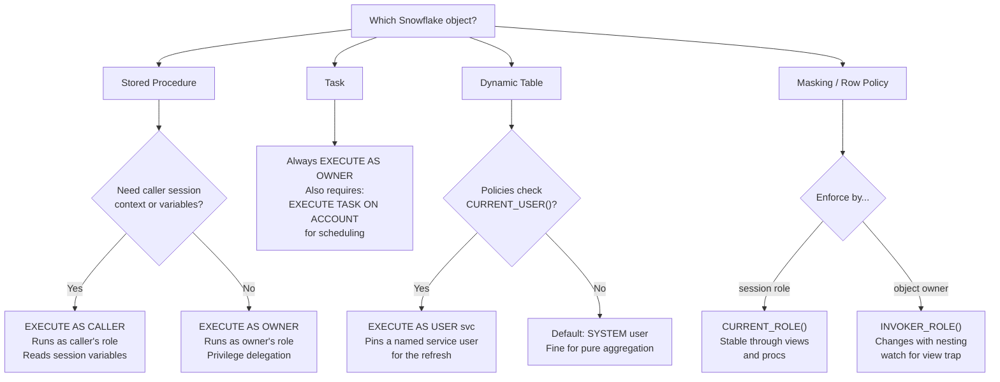

# Executor Role Blog Demo

Companion repository for the blog post:
**"Who Is Actually Running This? Snowflake's Executor Role, Explained"**

This repo contains:

1. **A Cortex Code skill** — an interactive, diagnostic workshop that teaches the Snowflake executor role model from first principles
2. **SQL examples** — all five worked examples from the blog, ready to run against `SNOWFLAKE_SAMPLE_DATA`

## What is the executor role?

In Snowflake, the role that *calls* an object is not the role that *runs* it. That distinction — the executor role — explains a whole class of permission errors that look like privilege bugs but are actually execution-context bugs.

## Decision Matrix

Pick the right `EXECUTE AS` setting for your object type:



## Get started

### Option A: Guided tour with Cortex Code

[Sign up for Snowflake with Cortex Code for Developers](https://signup.snowflake.com/?utm_source=cortexcode&utm_medium=devrel) — Cortex Code is included.

1. Clone this repo and open it in Cortex Code — the skill loads automatically from `.cortex/skills/`.
2. Start with a symptom or jump to a concept:

```
# Start with a symptom
My stored procedure fails with insufficient privileges even though the role has the grant.

# Or jump to a concept directly
$executor-role-workshop                  # full guided tour
$executor-role-workshop mental-model     # CURRENT_ROLE vs INVOKER_ROLE
$executor-role-workshop owners-rights    # privilege delegation
$executor-role-workshop masking          # masking policy context functions
$executor-role-workshop troubleshoot     # error → root cause → fix table
```

### Option B: DIY with Cortex Code — follow the blog

[Sign up for Snowflake](https://signup.snowflake.com/) if you don't have an account.

1. Clone this repo and open it in Cortex Code.
2. Read the [blog post](https://medium.com/@kameshsampath) alongside Cortex Code.
   Copy the SQL blocks from the blog into Cortex Code as you read —
   it handles connection, execution, and output display.

## SQL examples

| File | Concept |
|------|---------|
| `sql/01-owners-rights-proc.sql` | Owner's rights — privilege delegation via `EXECUTE AS OWNER` |
| `sql/02-execute-task.sql` | Task resume — `EXECUTE TASK` at the account level |
| `sql/03-dynamic-table.sql` | Dynamic table `EXECUTE AS USER` vs system user |
| `sql/04-masking-invoker-role.sql` | Masking policy using `INVOKER_ROLE()` |
| `sql/05-masking-caller-role.sql` | Masking policy using `CURRENT_ROLE()` / caller's rights |

All examples use `SNOWFLAKE_SAMPLE_DATA.TPCH_SF1` — available in every Snowflake account, no data loading required.

## Related resources

- [Blog post](https://medium.com/@kameshsampath) — "Who Is Actually Running This?"
- [Snowflake Executor Role Developer Cheatsheet](https://github.com/Snowflake-Labs/sf-cheatsheets/blob/main/executor-role-cheatsheet.md)

## License

Apache 2.0 — see [LICENSE](LICENSE)
